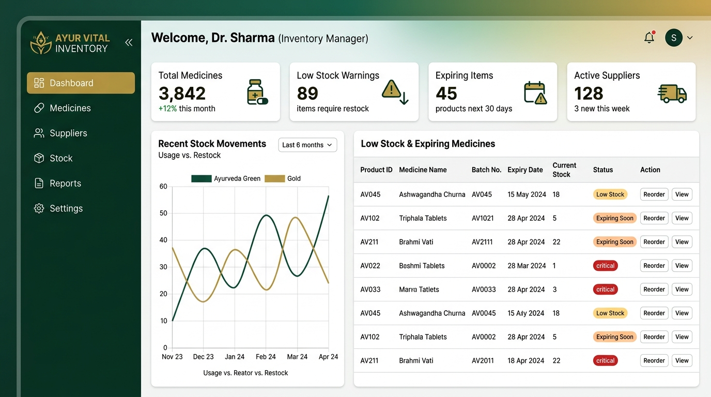
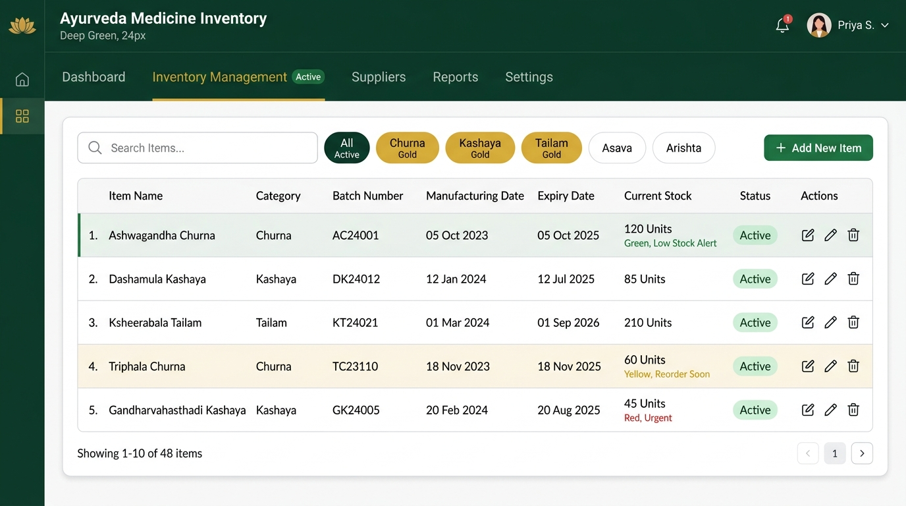

# 🌿 Disanayaka Ayurveda Hospital — Inventory Management System

A **professional, modern web-based Inventory Management System** built for Disanayaka Ayurveda Hospital. Designed to manage herbal medicine stock, suppliers, staff, and generate detailed reports — all with a clean Ayurveda-themed UI.

---

## ✨ Features

| Feature | Description |
|---------|-------------|
| 📊 **Dashboard** | Real-time stats — total items, low stock alerts, expiry warnings, supplier count |
| 💊 **Items Management** | Add, search, and track herbal medicines by category with stock status badges |
| 📦 **Stock In** | Record received stock with batch number, expiry date, supplier and unit price |
| 📤 **Stock Out** | Issue medicines to OPD, Patients, Departments with reason tracking |
| 🚚 **Suppliers** | Manage herbal medicine suppliers with contact details |
| 👥 **Users & Staff** | Role-based access (Admin / Staff) with secure login |
| 📄 **Reports** | Full inventory report, low stock alerts, expiry report — print-ready A4 |
| 📱 **Responsive** | Works on desktop, tablet and mobile with collapsible sidebar |

---

## 🎨 Design

- **Color palette:** Deep Ayurveda Green `#1a4731` · Sage Green `#52b788` · Muted Gold `#c9a84c`
- **Font:** Inter (Google Fonts)
- **Framework:** Bootstrap 5.3 + Bootstrap Icons
- **Charts:** Chart.js

---

## 🛠️ Tech Stack

- **Backend:** PHP 8.x
- **Database:** MySQL (via XAMPP)
- **Frontend:** HTML5 · Vanilla CSS · Bootstrap 5.3 · JavaScript
- **Server:** Apache (XAMPP)

---

## 🚀 Setup Instructions

### 1. Prerequisites
- [XAMPP](https://www.apachefriends.org/) installed (PHP + MySQL + Apache)

### 2. Clone the repository
```bash
git clone https://github.com/YOUR_USERNAME/ayurveda_inventory.git
cd ayurveda_inventory
```

### 3. Place in XAMPP htdocs
Copy or clone the project into:
```
C:\xampp\htdocs\ayurveda_inventory\
```

### 4. Create the database
1. Start **Apache** and **MySQL** in XAMPP Control Panel
2. Open [phpMyAdmin](http://localhost/phpmyadmin)
3. Create a new database named `ayurveda_inventory`
4. Import the database schema (ask project owner for schema SQL)

### 5. Configure database connection
Create `includes/db.php` (excluded from git for security):
```php
<?php
$host   = "localhost";
$user   = "root";
$pass   = "";           // your MySQL password
$dbname = "ayurveda_inventory";

$conn = new mysqli($host, $user, $pass, $dbname);
if ($conn->connect_error) {
    die("Connection failed: " . $conn->connect_error);
}
$conn->set_charset("utf8mb4");
?>
```

### 6. Load sample data (optional)
Import `seed_data.sql` in phpMyAdmin to load demo medicines, suppliers and transactions.

### 7. Open the app
Visit: [http://localhost/ayurveda_inventory/](http://localhost/ayurveda_inventory/)

**Default credentials:**
| Username | Password | Role |
|----------|----------|------|
| `admin` | `1234` | Admin |
| `pharmacist` | `1234` | Staff |
| `storekeeper` | `1234` | Staff |

---

## 📁 Project Structure

```
ayurveda_inventory/
├── includes/
│   ├── auth.php          # Session authentication check
│   └── db.php            # Database connection (⚠️ not in git)
├── dashboard.php          # Main dashboard
├── items.php              # Items management
├── stock-in.php           # Stock received records
├── stock-out.php          # Stock issued records
├── suppliers.php          # Supplier management
├── users.php              # User management (Admin only)
├── reports.php            # Inventory reports + print
├── login.php              # Login page
├── logout.php             # Session logout
├── style.css              # Shared design system
├── seed_data.sql          # Sample dataset
└── index.php              # Redirect to dashboard
```

---

## 📸 Screenshots

### 📊 Dashboard


### 💊 Medicine Items Management


---

## 🔒 Security Notes

- `includes/db.php` is excluded from version control (add to `.gitignore`)
- Passwords are stored as MD5 hashes
- Role-based access: Admin pages redirect non-admin users

---

## 📜 License

This project is developed for **Disanayaka Ayurveda Hospital** internal use.

---

*ආරෝග්‍ය පරම භාග්‍යං — Health is the greatest fortune* 🌿
